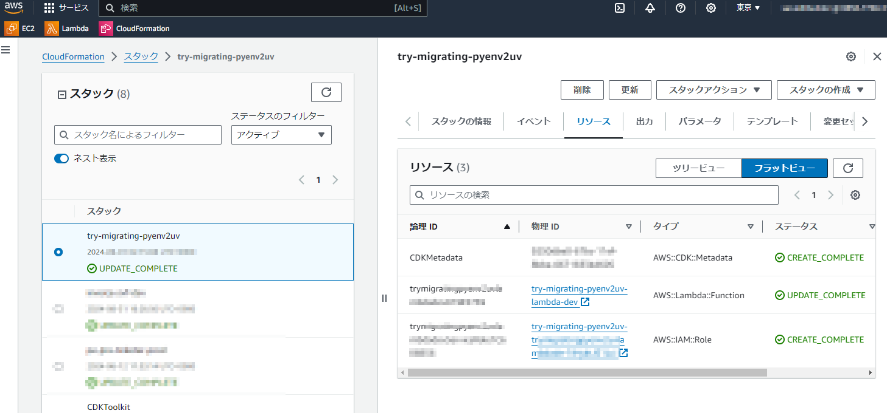
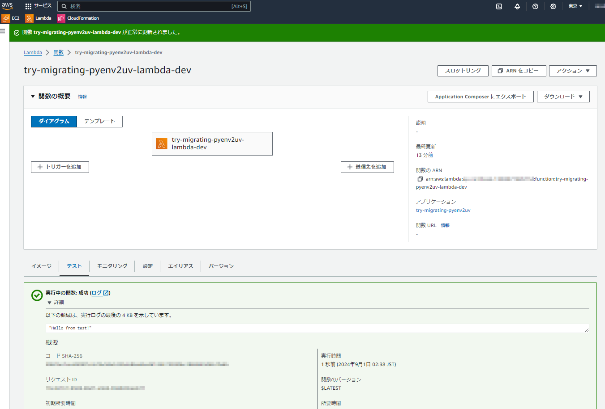

# try-migrating-pyenv2uv

This is a simple script to migrate pyenv virtualenvs to uv.

# installation

aws-cli - https://docs.aws.amazon.com/cli/latest/userguide/install-cliv2.html
aws-cdk - https://docs.aws.amazon.com/cdk/latest/guide/work-with-cdk-python.html
docker - https://docs.docker.com/engine/install/
uv - https://docs.astral.sh/uv/getting-started/installation/

# usage

```bash
$ uv python install 3.8 3.10 3.11 3.12
$ uv venv --python 3.12
$ uv run python -V
Python 3.12.5
$ uv python list
cpython-3.12.5-linux-x86_64-gnu     /home/ubuntu/.local/share/uv/python/cpython-3.12.5-linux-x86_64-gnu/bin/python3 -> python3.12
cpython-3.12.3-linux-x86_64-gnu     /usr/bin/python3.12
cpython-3.12.3-linux-x86_64-gnu     /usr/bin/python3 -> python3.12
cpython-3.12.3-linux-x86_64-gnu     /bin/python3.12
cpython-3.12.3-linux-x86_64-gnu     /bin/python3 -> python3.12
cpython-3.11.9-linux-x86_64-gnu     /home/ubuntu/.local/share/uv/python/cpython-3.11.9-linux-x86_64-gnu/bin/python3 -> python3.11
cpython-3.10.14-linux-x86_64-gnu    /home/ubuntu/.local/share/uv/python/cpython-3.10.14-linux-x86_64-gnu/bin/python3 -> python3.10
cpython-3.9.19-linux-x86_64-gnu     <download available>
cpython-3.8.19-linux-x86_64-gnu     /home/ubuntu/.local/share/uv/python/cpython-3.8.19-linux-x86_64-gnu/bin/python3 -> python3.8
pypy-3.7.13-linux-x86_64-gnu        <download available>
$ uv tree
Resolved 9 packages in 7ms
test v0.1.0
├── boto3 v1.35.10
│   ├── botocore v1.35.10
│   │   ├── jmespath v1.0.1
│   │   ├── python-dateutil v2.9.0.post0
│   │   │   └── six v1.16.0
│   │   └── urllib3 v2.2.2
│   ├── jmespath v1.0.1
│   └── s3transfer v0.10.2
│       └── botocore v1.35.10 (*)
└── ruff v0.6.3 (group: dev)
(*) Package tree already displayed
$ uv init test
$ uv add ruff --dev
$ uv add boto3
$ uv run python -V
Python 3.12.5
$ uv run python -m hello
Hello from test!
$ uv run ruff check
All checks passed!
$ uv run python -m unittest discover tests -v
test_hello (test_hello.TestHello.test_hello) ... ok

----------------------------------------------------------------------
Ran 1 test in 0.000s

OK
$
```

# deployment

```bash
$ uv run npx cdk bootstrap --profile default --context env=dev
$ uv run npx cdk synth --profile default --context env=dev --all
$ uv run npx cdk deploy --profile default --context env=dev --all --require-approval never
```

# deployed image

**Cfn Stack**


**lambda testing**


